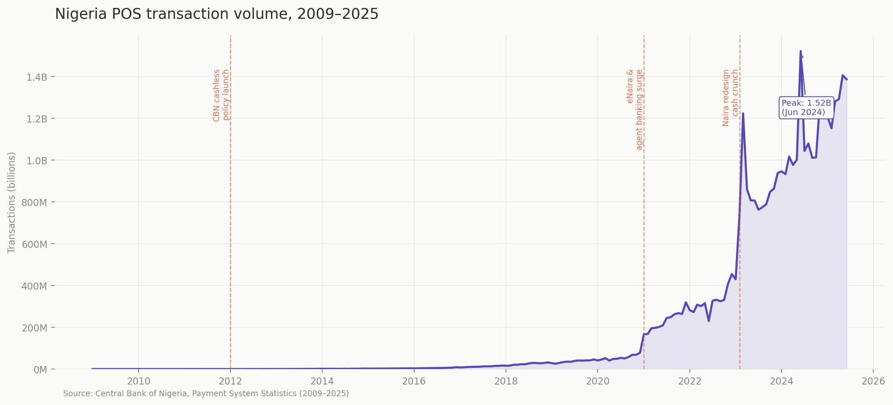
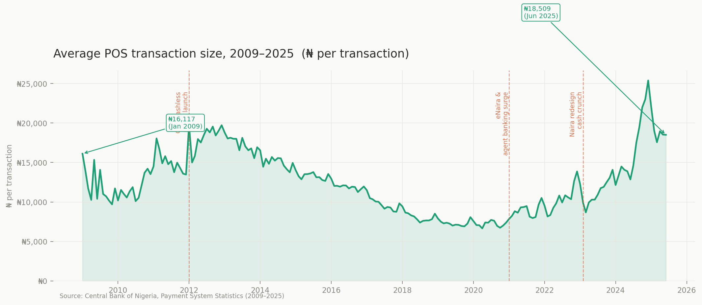

# Transaction Behavior Patterns in Nigeria's Digital Payment Ecosystem

A data-driven analysis of SME payment trends and financial inclusion dynamics in Nigeria, using 16 years of payment system data.

---

## 📌 Overview

Nigeria’s digital payment ecosystem has experienced explosive growth over the past decade, particularly through Point-of-Sale (POS) systems and agent banking networks.

This project analyzes transaction data from 2009–2025 to understand:
- How digital payment adoption has evolved
- What drives sustained usage
- Where the next wave of growth will come from

---

## ❓ Key Question

**What does Nigeria’s payment data reveal about the next phase of digital financial adoption — and what is still preventing full participation?**

---

## 📊 Key Insights

- **15,500× growth in POS transactions** from 2009 to 2025  
- Growth has been **wide, not deep** — driven by new users rather than increased spending  
- Average transaction size remained relatively stable, indicating **strong penetration into micro-business segments**  
- The 2023 cash shortage acted as a **behavioral forcing event**, accelerating digital adoption  
- **Infrastructure density (agent networks)** is the strongest predictor of sustained usage  

---

## 🧠 Core Thesis

> Nigeria has largely solved for access.  
> The next frontier is **depth** — converting millions of agent-reached users into fully active financial participants.

---

## 🏗️ Project Structure

### 1. Transaction Landscape
- Time series analysis of POS transaction volume and value  
- Identification of three growth phases:
  - Policy-driven (2012–2020)
  - Infrastructure-driven (2021)
  - Crisis-driven (2023)

### 2. Merchant Behavior Model
A simple framework for understanding adoption:

- **Stage 1:** Cash-dominant  
- **Stage 2:** Transitional  
- **Stage 3:** Digital-first  

### 3. Financial Inclusion Context
- Gap between access and active usage  
- Role of income patterns and account ownership  

---

## 📈 Sample Visualizations

---

## 🛠️ Tools & Technologies

- Python (pandas, numpy)
- Data visualization (matplotlib, seaborn)
- Jupyter Notebook

---

## 📂 Data Sources

- Central Bank of Nigeria (CBN) – Payment System Statistics  
- EFInA Access to Finance Survey (2023)  
- World Bank Global Findex (2021)  

---

## 📎 Project Files

- 📊 Full Analysis Report → `reports/full_report.pdf`  
- 📈 Jupyter Notebook → `notebooks/analysis.ipynb`  
- 📉 Dataset → `data/pos_transactions.csv`  
- 📽️ Presentation Deck → `presentation/nigeria_payments_deck.pptx`  

---

## 🚀 Why This Matters

Understanding transaction behavior is critical for building financial systems that:
- Scale effectively  
- Reach underserved populations  
- Drive meaningful financial inclusion  

This analysis highlights where the biggest opportunities lie in Nigeria’s evolving fintech ecosystem.

---

## 👤 Author

**Iyanujesu Obakoya**  
Data Scientist  
